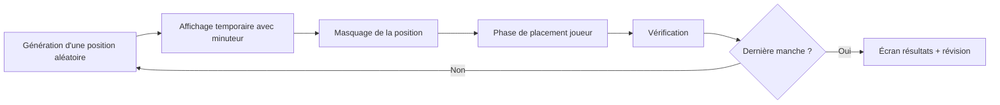

# Chess Memory

Jeu de mémoire basé sur l'échiquier: observe une position pendant quelques secondes, puis replace les pièces au bon endroit.

## Objectif

Retrouvez le plus de pièces possibles (type + couleur + case) après la phase de mémorisation.

## Fonctionnalités

- Paramètres de partie configurables:
	- prénom joueur,
	- nombre de manches (1 à 20),
	- durée d'affichage de la position (1 à 60 secondes).
- Difficultés prédéfinies:
	- Facile: 2 pièces,
	- Moyen: 6 pièces,
	- Difficile: 9 pièces.
- Mode personnalisé:
	- même nombre de pièces sur toutes les manches,
	- ou nombre de pièces différent pour chaque manche.
- Sélection du style de pièces (ex: Neo, Dash) avec aperçu en échiquier.
- Interactions de jeu en clic et en glisser-déposer.
- Minuteur circulaire pendant la phase de mémorisation.
- Écran de résultats complet:
	- score par manche,
	- score total,
	- bouton Revoir pour comparer ta réponse à la solution.
- Sauvegarde locale des préférences via localStorage (nom, options, style de pièces, etc.).

## Comment jouer

1. Ouvrir le jeu depuis la page d'accueil mini-jeux.
2. Choisir les options de partie.
3. Cliquer sur Commencer.
4. Mémoriser la position affichée pendant le décompte.
5. Replacer les pièces depuis la réserve sur l'échiquier.
6. Cliquer sur Vérifier.
7. Passer à la manche suivante ou consulter les résultats finaux.

## Règles de score

- 1 point par pièce correctement replacée.
- Une pièce est correcte si les 3 conditions sont vraies:
	- bonne case,
	- bon type,
	- bonne couleur.

Formules:

```text
Score manche = nombre de pièces correctes
Score total  = somme des scores de toutes les manches
Score max    = somme des pièces attendues sur toutes les manches
```

## Flux d'une manche



## Architecture du code

Le jeu est en JavaScript vanilla, découpé par responsabilité:

- index.html
	- structure des 3 écrans: accueil, jeu, résultats.
- style.css
	- styles du jeu (menu, échiquier, réserve, boutons, timer).
- js/config.js
	- constantes globales (sets de pièces, timer, seuil drag).
- js/state.js
	- état mutable de la partie (manche, score, placements, etc.).
- js/logic.js
	- fonctions pures (génération, mélange, comparaison, utilitaires).
- js/dom.js
	- références DOM et helpers d'affichage communs.
- js/board.js
	- rendu de l'échiquier et des pièces.
- js/dragdrop.js
	- interactions utilisateur (clic + drag and drop).
- js/menu.js
	- gestion des options de menu et lancement d'une partie.
- js/game.js
	- boucle des manches, timer, vérification.
- js/results.js
	- tableau récapitulatif et révision des manches.
- js/storage.js
	- persistance des préférences en localStorage.
- js/main.js
	- initialisation globale.

## Arborescence

```text
chess-memory/
	index.html
	style.css
	README.md
	js/
		board.js
		config.js
		dom.js
		dragdrop.js
		game.js
		logic.js
		main.js
		menu.js
		results.js
		state.js
		storage.js
	pieces/
		neo/
		dash/
		...
```

## Lancer le jeu en local

Depuis le dossier parent mini-jeux-amis:

```bash
python -m http.server 8000
```

Puis ouvrir:

- http://localhost:8000/chess-memory/

## Ajouter un set de pièces

1. Créer un dossier dans pieces/<id>/.
2. Ajouter les 12 images attendues:
	 - wk.png, wq.png, wr.png, wb.png, wn.png, wp.png,
	 - bk.png, bq.png, br.png, bb.png, bn.png, bp.png.
3. Déclarer le set dans js/config.js, tableau PIECE_SETS.

### Caractéristiques des images

Les sets de pièces utilisés respectent ces spécifications:

- **Format**: PNG (format lossless avec compression).
- **Transparence**: alpha channel (fond transparent).
- **Dimensions**: généralement **100x100 pixels** ou **128x128 pixels** (peut varier selon le style).
- **Nomenclature**: 
  - `w` = white (blanc), `b` = black (noir),
  - `k` = king, `q` = queen, `r` = rook, `b` = bishop, `n` = knight, `p` = pawn.
  - Exemple: `wk.png` = roi blanc, `bp.png` = pion noir.

### Sets disponibles

Le jeu vient actuellement avec 2 sets activés (neo, dash), mais tu as accès à **36 autres sets** préchargés:

- **Styles 3D**: 3d_chesskid, 3d_plastic, 3d_staunton, 3d_wood
- **Styles stylisés**: 8_bit, alpha, blindfold, book, bubblegum, cases, classic, club, condal, dash, game_room, glass, gothic, graffiti, icy_sea, light, lolz, marble, maya, metal, modern, nature, neo, neon, neo_wood, newspaper, ocean, sky, space, tigers, tournament, vintage, wood
- **Dossier spécial**: bases (pour les socles).

Pour activer un set supplémentaire, il suffit de l'ajouter au tableau `PIECE_SETS` dans `js/config.js`.

## Crédits

- Jeu développé en JavaScript vanilla.
- Ressources de sets de pièces récupérées depuis:
	- https://github.com/GiorgioMegrelli/chess.com-boards-and-pieces
